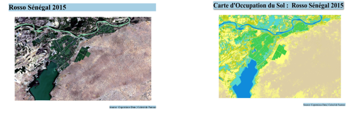
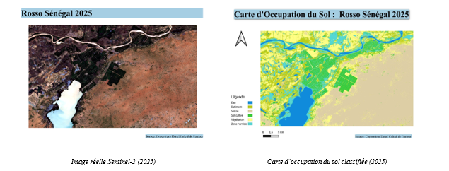

# Cartographie de l’occupation du sol — Rosso

[](https://github.com)
[](https://browser.dataspace.copernicus.eu)

## Description

Ce projet présente une analyse de classification de l’occupation du sol pour la ville de Rosso (Mauritanie/Sénégal) sur deux dates : 2015 et 2025.

L’étude utilise des images Sentinel-2 et des indices spectraux pour générer des cartes d’occupation du sol par classification supervisée SVM.

## Table des matières

- [Fonctionnalités](#fonctionnalit%C3%A9s)
- [Structure du dépôt](#structure-du-d%C3%A9p%C3%B4t)
- [Données](#donn%C3%A9es)
- [Installation](#installation)
- [Utilisation](#utilisation)
- [Résultats](#r%C3%A9sultats)
- [Contribuer](#contribuer)
- [Licence](#licence)

## Fonctionnalités

- Prétraitement des images Sentinel-2 pour 2015 et 2025
- Calcul de 5 indices spectraux : NDVI, NDWI, NDBI, SAVI et BSI
- Seuillage automatique Otsu sur chaque indice
- Empilement raster multi-bandes
- Extraction de statistiques zonales pour les données d’entraînement
- Classification supervisée par SVM et évaluation de la précision

## Structure du dépôt

- `scripts/` : scripts Python de traitement et d’analyse
- `docs/` : rapports, projet QGIS et images de présentation
- `data/raw/` : données source (Sentinel-2, shapefiles d’entrée)
- `data/processed/` : produits dérivés et résultats intermédiaires
- `models/` : modèles de classification entraînés
- `outputs/` : résultats finaux et exports, y compris les images de prédiction pour 2015 et 2025

## Données

Les images Sentinel-2 proviennent de Copernicus :

https://browser.dataspace.copernicus.eu/?zoom=5&lat=50.16282&lng=20.78613&demSource3D=%22MAPZEN%22&cloudCoverage=30&dateMode=SINGLE

### Données utilisées

- Images Sentinel-2 Level-2A (réflectance de surface)
- Shapefiles d’apprentissage (`bd_train_2015`, `bd_train_2025`)
- Shapefiles de test (`Bd_test_2015`, `Bd_test_2025`)
- ROI et zones d’étude

## Installation

1. Cloner le dépôt :

```bash
git clone <url-du-depot>
cd "Projet Final"
```

2. Installer les dépendances Python requises :

```bash
pip install numpy gdal scikit-image python-docx pdfplumber
```

3. Ouvrir le projet QGIS depuis `docs/projet_classification.qgz` si nécessaire.

## Utilisation

### 1. Prétraitement et seuillage

Exécuter :

```bash
python scripts/seuillage.py
python scripts/stacking.py
```

### 2. Extraire les statistiques zonales

Exécuter dans l’environnement QGIS :

```bash
python scripts/ajoute_indice_mean_base.py
```

### 3. Calculer les seuils Otsu

Exécuter :

```bash
python scripts/calcul_applicatication_seuil.py
```

### 4. Analyse des données

- `scripts/stat_desc_bd.py` permet d’extraire des statistiques descriptives des bases de données spatiales.

## Résultats

- Classification SVM de l’occupation du sol pour 2015 et 2025
- Images de prédiction générées après calcul pour 2015 et 2025 dans le dossier `outputs/`
- Cartes de classes : Eau, Bâti, Sol nu, Sol cultivé, Jachère, Zone humide
- Évaluation par matrice de confusion, Overall Accuracy et coefficient Kappa

### Visualisation des prédictions

Près des résultats de prédiction, les images suivantes sont disponibles :





## Contribuer

Les contributions sont bienvenues.

1. Forkez le dépôt
2. Créez une branche feature
3. Faites vos modifications
4. Ouvrez une pull request

## Licence

Ce projet peut être partagé librement avec mention de l’auteur.
